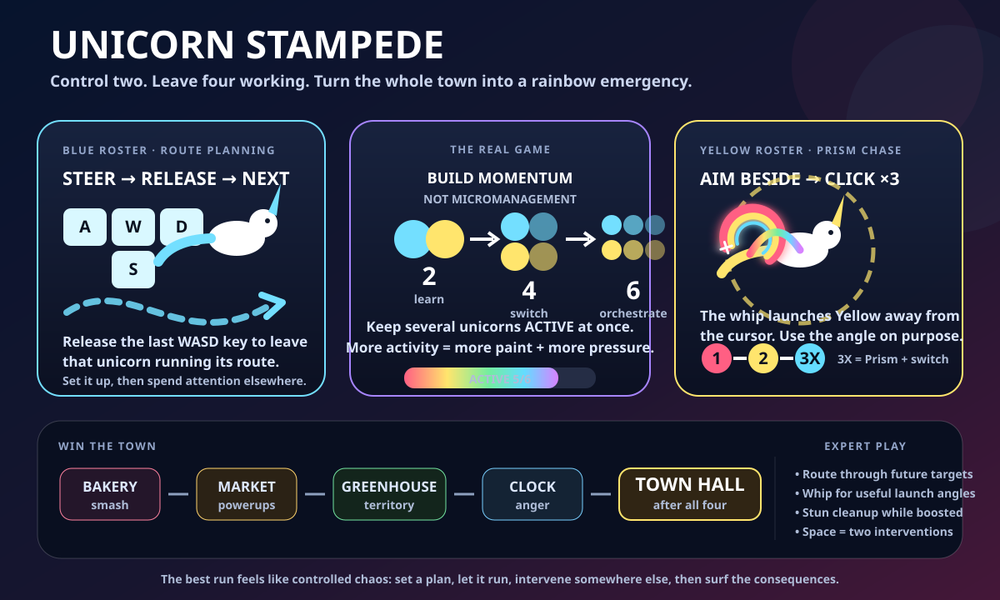

# 🦄 Unicorn Stampede

**A six-unicorn arcade-strategy riot built for js13kGames 2026.** You directly control only two unicorns at a time. The other four keep running the routes and impulses you leave behind, so the game becomes a fast loop of **steer → release → whip → switch → improvise** while an increasingly alarmed town tries to clean up your rainbow catastrophe.

<p align="center">
  
</p>

## 🎮 Play it

The repository now keeps the **qualified `dist/` build on `main`**, so you do not need Node just to try the game:

- **`dist/local.html`** — recommended human-playable build. Download it and open it in a desktop browser.
- **`dist/unicorn-stampede.zip`** — exact js13k submission archive, containing one root `index.html`.
- **`dist/index.html`** — aggressively compressed competition HTML.
- **`dist/preview.html`** — browser-safe self-contained build, byte-identical to `local.html`.
- **`dist/compression.json`** — compression provenance for the checked-in submission.

The checked-in `dist/` is generated from the green `main` build. Do not hand-edit it; change `src/`, qualify the game, then refresh `dist/` from the successful build.

## ⚡ The 20-second mental model

You have **six unicorns**, but only two direct-control roles:

| Role | Unicorns | You do | When you let go |
| --- | --- | --- | --- |
| 🔵 **Blue** | Bolt, Daisy, Bumper | Hold **WASD** to steer | Releasing the final movement key leaves that unicorn running its route and Smart Next can hand you another Blue |
| 🟡 **Yellow** | Mallow, Comet, Pickles | Aim the rainbow-whip cursor beside the highlighted Yellow and **click** | A **3X Prism** chain, or chain timeout, rotates control to another Yellow |
| 🌈 **Everyone else** | the other live unicorns | Let them work | They keep moving semi-autonomously from your last useful setup |

The campaign teaches this as **2 → 4 → 6 unicorns**. You are not supposed to perfectly micromanage the herd. You are supposed to create useful motion, leave it behind, and jump to the next interesting problem.

## 🕹️ Controls

### Blue: route planning

- **W / A / S / D** — directly steer the current Blue unicorn.
- **Release the last held WASD key** — commit its current run direction and rotate to the next useful Blue when another is live.
- Think of release as **“keep doing that while I solve something else.”**

### Yellow: Rainbow Whip

- Move the mouse. The cursor is a large **coiled rainbow whip**; its white center is the exact strike origin.
- Aim **beside** the highlighted Yellow unicorn, inside its glowing orbit.
- **Left click** — crack the whip instantly. Yellow launches *away from the cursor*, so your aim controls the launch vector.
- Hit again before the chain timer expires for **2X**, then **3X Prism**.
- **3X Prism** gives the biggest smash/paint payoff and rotates control to another Yellow.

### Shared / utility

- **Space** — dash both currently controlled unicorns.
- **A / D on the title screen** — choose an unlocked campaign world.
- **P** or **Esc** — pause.
- **M** — mute/unmute.
- **T on the title screen** — replay the Little Cross tutorial.

## 🏙️ How you win

Every full town has five landmarks:

1. **Bakery**
2. **Market**
3. **Greenhouse**
4. **Clock Tower**
5. **Town Hall**

The Town Hall begins shielded. **Destroy the first four landmarks to drop the shield, then smash Town Hall.**

A basic Town Hall conquest advances the campaign. Better runs earn up to **★★★** by combining the win with strong rainbow territory coverage and successful Prism chains.

## 🌪️ How the game is meant to feel

The fun is not “drive one unicorn perfectly.” It is **controlled chaos**.

A satisfying sequence looks like this:

1. Send Bolt down a useful street with WASD.
2. Release him so he keeps working.
3. Immediately jump your attention to Mallow.
4. Crack the whip from an angle that launches her toward a landmark.
5. Chase the 2X/3X opportunity if it is worth it.
6. Notice a cleaner erasing an important district.
7. Switch back to Blue, intercept it, then abandon that unicorn on another productive route.
8. Use `Space` when both current captains can convert one button press into two useful interventions.

You should frequently be thinking **“that one is fine for now, what can I make happen somewhere else?”**

## 🧠 Strategies to discover

### 1. Route-and-rotate

Do not keep steering Blue after the route is already useful. The moment a unicorn is headed somewhere productive, **release and spend your attention elsewhere**. Strong play comes from several acceptable plans running at the same time, not one perfect plan.

### 2. Whip for direction, not just damage

The Rainbow Whip is a vector tool. Clicking to the left of Yellow sends it right; cracking below it sends it upward. A well-angled whip can simultaneously:

- continue a Prism chain;
- cross a weakly painted district;
- collide with a landmark;
- hit a powerup;
- stun a cleanup vehicle while boosted;
- set up the next autonomous run.

The best crack is usually the one whose **aftermath** is useful.

### 3. Know when *not* to chase 3X

3X Prism is powerful, but tunnel vision is expensive. If another unicorn is stalled, a landmark is nearly broken, or cleanup is deleting your best territory, abandoning a chain can be correct. The game rewards attention management more than ritual completion.

### 4. Treat `ACTIVE` as your heat meter

`ACTIVE 5/6` means five unicorns are currently doing useful work through routes, boosts, frenzy, dashes, or active painting.

Higher activity gives you more paint and momentum, **but the city fights back harder**. Cleaners accelerate their response, Washwater becomes more aggressive, and Cloudtop winds become nastier. High `ACTIVE` is both power and danger.

### 5. Choose landmark order tactically

You only need all four outer landmarks before Town Hall, but their side effects make order matter:

- **Market** drops useful powerups.
- **Greenhouse** creates a burst of visual/territory momentum.
- **Clock Tower** raises herd anger and can help turn the closing phase into a rampage.
- **Bakery** is a straightforward early target and a good place to build rhythm.

There is no single correct order. Your current routes and where the herd already is should influence the plan.

### 6. Weaponize cleanup

Cleanup vans are not merely obstacles. A boosted, dashing, or frenzied unicorn can **stun** them. That creates a tactical choice: spend momentum smashing the objective, or temporarily remove the thing erasing your score and territory.

### 7. Use the Smart Attention Director as a suggestion, not an autopilot

When control rotates, the game can surface reasons such as:

- `DISTRACTED`
- `WEAK AREA`
- `POWERUP`
- `STALLED`
- `NEXT`

That is an attention hint. You still decide what the intervention should be.

### 8. Build two-fire `Space` moments

`Space` dashes both current captains. Instead of pressing it whenever it is available, look for moments where **both Blue and Yellow are pointed at something valuable**. One key press can then become two collisions, two escapes, or two territory pushes.

## 🌍 Campaign worlds

### Prismborough — orchestration

The baseline town. Learn to keep multiple plans alive while traffic, cleanup, distractions, and five landmark objectives compete for your attention.

- Time: **100 s**
- Mastery: Town Hall + 60% paint + 2 Prism chains

### Washwater Bay — defend success

Powerwashers and a helicopter attack the areas where you are doing best. The helicopter telegraphs its drops, so you can route away, reclaim territory, or use the attack as a cue to pressure somewhere else.

- Time: **94 s**
- Mastery: Town Hall + 48% paint + 2 Prism chains

### Cloudtop Heights — prediction

Crosswinds push the whole herd, Rainbow Whips launch farther, and chain timing gets tighter. The better your stampede is doing, the stronger the wind pressure becomes.

- Time: **90 s**
- Mastery: Town Hall + 54% paint + 3 Prism chains

## ✨ Stampede+

Conquering Cloudtop unlocks an encore loop instead of ending the game.

Stampede+ recombines mechanics you already learned:

- six fewer seconds;
- an extra cleanup van immediately;
- 10% faster traffic;
- roaming gusts in Prismborough and Washwater;
- four optional **Prism Gates**.

Route any live unicorn through a Prism Gate to collect it for **score + a temporary speed boost**. Gates are deliberately made from the same tiny canvas primitives used elsewhere, so they function as scenery, navigation, collectibles, and route-planning temptations without adding image assets.

## 👑 Three-crown mastery and replaying

One crown is enough to progress. Additional crowns reward better territory control and Prism execution. Your best crowns persist per world, so replaying is about becoming better at the system rather than grinding stats.

Each attempt also advances a deterministic remix seed. Buildings, civilians, local geometry, and several landmark placements vary while the strategic grammar stays recognizable: **same exam, different questions**.

## 🦄 Meet the herd

The six unicorns share the same core rules but have different movement/impact tendencies:

- 🔵 **Bolt** — quick and eager to cover ground.
- 🔵 **Daisy** — steadier and easier to place precisely.
- 🔵 **Bumper** — heavier destructive personality.
- 🟡 **Mallow** — controlled Whip target with a tighter feel.
- 🟡 **Comet** — fast, energetic Prism chaser.
- 🟡 **Pickles** — wilder movement and stronger momentum.

You do not need to memorize a stat sheet. Their differences are meant to become something you *feel* and exploit over repeated runs.

## 🧪 Tutorial philosophy

**Little Cross** is intentionally short and teaches only mechanics that are immediately actionable:

1. steer Blue with WASD and release to leave it working;
2. click Yellow's ring to crack the Whip;
3. complete a 3X Prism chase;
4. smash the Bakery.

Powerups, distractions, rescue, cleanup, world hazards, and advanced routing are learned through the actual campaign instead of front-loading a manual.

## 🛠️ Development

Readable source stays modular under `src/`.

```bash
npm install
npm run build:fast   # quick browser-safe dist/local.html
npm test             # full behavioral + compression + packed-runtime qualification
npm run build        # full compression tournament
```

The repository root `index.html` is the readable development entrypoint. For quick human testing, use `dist/local.html`.

### Build pipeline

The submission build compares several Terser / property-mangling / Roadroller / DEFLATE / AdvZIP / Zopfli combinations and selects the smallest artifact that still passes the packed-runtime smoke tests.

The checked-in v0.20 `main` snapshot is **13,193 / 13,312 bytes**, leaving **119 bytes** under the js13k limit. The compression search has a small stochastic component, so `dist/compression.json` is the authoritative exact-size record for whichever qualified snapshot is currently committed.

### Why `dist/` is committed

`dist/` used to be ignored and existed only as a GitHub Actions artifact, which made the actual playable/submission files unnecessarily hard to find. The repository now tracks the **qualified distribution snapshot** on `main` so players, reviewers, and competition submission work all have an obvious canonical build.

Source remains authoritative. `dist/` is a release snapshot, not a place to edit gameplay.

## 📚 Design notes

Deeper implementation/design contracts live in:

- `docs/CAMPAIGN_WORLDS.md`
- `docs/CREATIVE_RESERVE.md`
- `docs/COMPRESSION.md`
- `docs/PRISM_CHASE.md`
- `docs/SMART_DIRECTOR.md`
- `docs/TOP10_CAMPAIGN.md`

---

**Design target:** every few seconds, the player should either create a useful route, land a satisfying Whip, switch attention, smash something, rescue a failing plan, or watch a plan they left behind pay off. If the screen looks slightly ridiculous but your decisions still feel intentional, Unicorn Stampede is doing its job. 🌈
